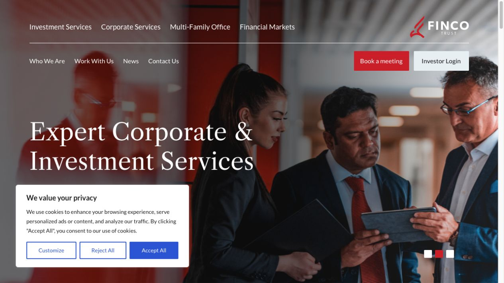
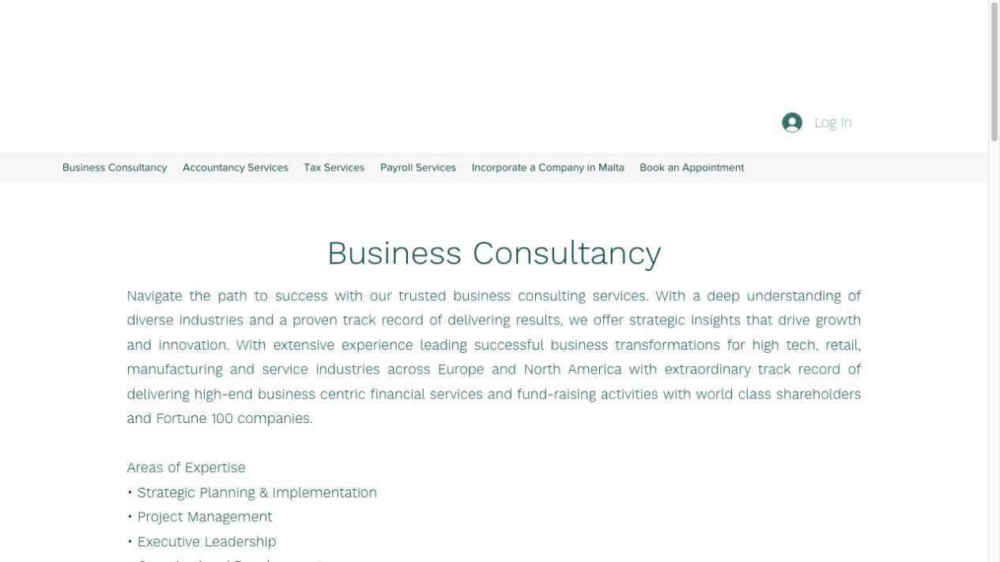
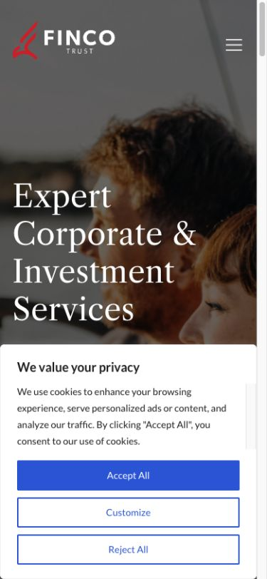
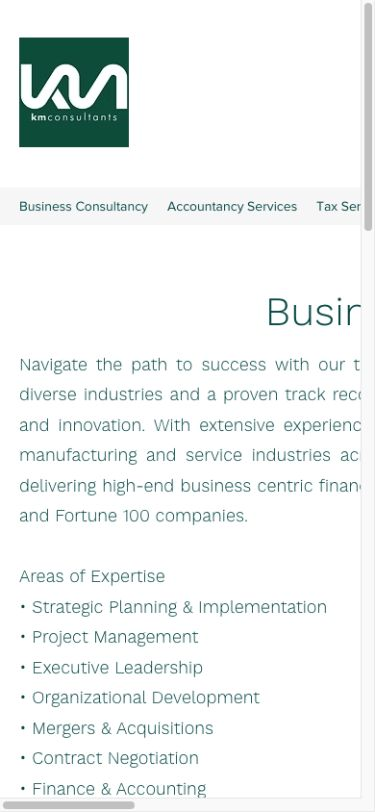

# KMFINCO combined website audit

Audit date: 20 July 2026

## Executive verdict

The combined site should use Finco Trust's strongest assets—credibility, senior-professional imagery, breadth of investment/corporate services, and clear meeting/login actions—while replacing its dense two-tier navigation and intrusive first-visit cookie experience with a quieter editorial structure.

KM Consultants contributes practical business, accounting, tax, payroll, incorporation, coaching, and implementation-led language. Its present site, however, needs a stronger visual hierarchy, a more focused value proposition, and a responsive navigation/layout that does not overflow on small screens.

The opportunity is a single premium advisory platform built around one promise: integrated guidance across assurance, management consulting, business operations, structure, finance, and wealth.

## Evidence

### 1. Finco Trust — desktop homepage

Health: strong credibility and visual presence; overloaded first interaction.

- Strengths: polished real-team photography, a confident serif headline, visible meeting and investor actions, and broad service authority.
- UX issues: the two-row navigation asks users to process too many choices before the proposition; the cookie panel obscures a large portion of the hero; competing CTAs dilute the preferred conversion path.
- Accessibility risks visible from the capture: white text crosses a high-variance photograph, so contrast may vary by slide; the cookie layer dominates the viewport and should be checked for focus order, keyboard escape, and screen-reader labelling.

### 2. KM Consultants — desktop homepage

Health: useful service content; weak first-impression hierarchy.

- Strengths: practical service labels and detailed expertise establish clear operational capability.
- UX issues: excessive empty space delays the core message; the small logo and thin navigation lack authority; long centred/justified copy is difficult to scan; there is no dominant conversion action in the first viewport.
- Accessibility risks visible from the capture: light teal text on white may not meet contrast requirements at smaller sizes; long lines increase reading effort; the visual hierarchy relies mostly on font size rather than structure.

### 3. Finco Trust — mobile homepage

Health: responsive hero is broadly effective; consent experience blocks the journey.

- Strengths: the headline remains readable and the main navigation collapses cleanly.
- UX issues: the cookie panel takes most of the viewport and hides the primary next step; the hero text occupies many lines and leaves no visible supporting proposition or CTA.
- Accessibility risks visible from the capture: the modal must trap focus correctly without preventing users from understanding the page; full-width stacked buttons should expose distinct accessible names and states.

### 4. KM Consultants — mobile homepage

Health: critical responsive failure.

- Strengths: the core list of services remains present.
- UX issues: the desktop navigation does not collapse, the page overflows horizontally, the headline and copy are clipped, and users must pan sideways to read content.
- Accessibility risks visible from the capture: clipped text and horizontal scrolling make the page difficult for low-vision, motor-impaired, and mobile users; the navigation needs a keyboard-accessible disclosure pattern.

## Global benchmark lessons

- McKinsey: editorial confidence, sparse top-level choices, large ideas-led headlines, and disciplined content rhythm.
- Deloitte: a short unifying promise supported by a small set of current priority topics and thought leadership.
- PwC Rwanda: direct outcome language, local-market relevance, and clear separation of industries, services, and insights.
- KPMG: strong thematic content groupings and pathways from insight to service expertise.

The new site should borrow these structural principles, not their proprietary visual identities.

## Recommended combined architecture

1. Home — one promise, one primary action, four integrated capability pillars.
2. Services — Audit & Assurance; Management Consulting; Tax, Accounting & Payroll; Corporate & Fiduciary; Investment & Family Office.
3. Who we help — Businesses; Investors & Families; International Organisations.
4. Insights — concise, evidence-led articles grouped by topic.
5. About — principles, senior team, jurisdictions, and governance.
6. Contact — a low-friction conversation form and direct office details.

## Recommended first-page narrative

1. Hero: a distinctive promise and one clear action.
2. Trust strip: jurisdictions, client types, and regulated-service context only where verified.
3. Five capability pillars: Audit & Assurance; Management Consulting; Tax, Accounting & Payroll; Corporate & Fiduciary; Investment & Family Office.
4. Integrated advisory model: show how strategy, operations, compliance, and capital connect.
5. Featured insight: demonstrate current thinking without overwhelming the homepage.
6. Senior-team proof: real people, short credentials, no generic stock portraits.
7. Closing invitation: a single conversation CTA with a short expectation statement.

## Design principles for the redesign

- Editorial minimalism: generous whitespace, fine rules, strong typography, and very limited card chrome.
- Premium restraint: warm off-white, near-black, a deep institutional green, and one restrained red accent inherited from Finco.
- Human expertise: real advisory photography or art-directed portraits, used sparingly and with purposeful crops.
- Mobile first: no horizontal overflow; a compact disclosure menu; 44px minimum touch targets; readable line lengths.
- Accessible by default: visible focus, semantic headings, high-contrast text, reduced-motion support, and form labels that do not rely on placeholders.

## Confirmed service model

### Audit & Assurance

- External audit and financial statement assurance
- Other assurance and agreed-upon procedures
- Financial reporting and controls assurance

### Management Consulting

- Strategy and transformation
- Internal audit and controls
- Risk management
- Governance, regulatory compliance, and operational improvement

### Tax, Accounting & Payroll

- Tax advisory and compliance
- Accounting and financial reporting
- Payroll and related compliance

### Corporate & Fiduciary

- Company formation and corporate administration
- Company secretarial and governance support
- Fiduciary and related corporate services

### Investment & Family Office

- Investment advisory
- Family-office support and governance
- Financial planning and wealth structuring

## Evidence limits

This visual audit covers the public homepages and their first desktop/mobile viewports. Screenshot evidence cannot establish full WCAG conformance, keyboard behaviour, screen-reader quality, performance, analytics, SEO implementation, or conversion performance; those require interactive and technical testing.
